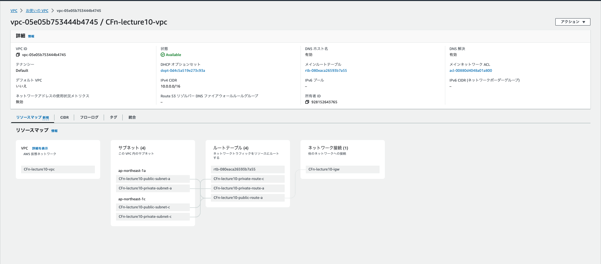
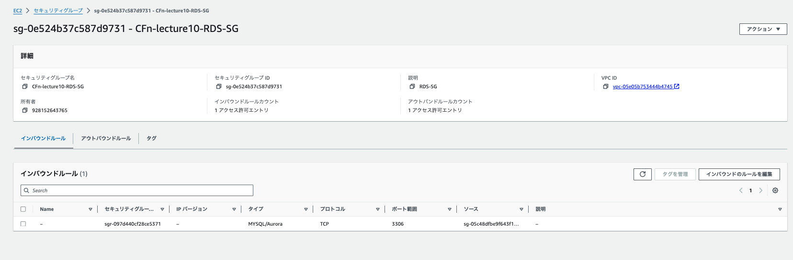

# 第10回課題

## CloudFormation を利用し、現在までに作った環境をコード化する。
* テンプレートをNetwork、Security、Application に分けて作成。

| CFnテンプレート|リソース内訳|
|:--|:--|
|[CFn_Network.yml](./tpl/lecture10_CFn/CFn_Network.yml)|⚫︎ VPC ⚫︎ InternetGateway ⚫︎ InternetGatewayAttachment ⚫︎ PublicSubnetA,C ⚫︎ PrivateSubnetA,C ⚫︎ PublicRouteTable ⚫︎ PrivateRouteTable(A,C) ⚫︎ PublicRoute ⚫︎ PublicSubnet(A,C)RouteTableAssociation ⚫︎ PrivateSubnet(A,C)RouteTableAssociation|
|[CFn-Security.yml](./tpl/lecture10_CFn/CFn-Security.yml)|⚫︎ EC2SG (EC2 Security Group) ⚫︎ ALBSG (ALB Security Group) ⚫︎ RDS Security Group (RDSSG) ⚫︎ ManagedPolicy (IAM Policy) ⚫︎Role (IAM Role) ⚫︎ InstanceProfile|
|[CFn-Application.yml](./tpl/lecture10_CFn/CFn-Application.yml)|⚫︎ NewKeyPair ⚫︎ Ec2Instance ⚫︎ ALB ⚫︎ ListenerHTTP ⚫︎ TargetGroup ⚫︎ KmsKey ⚫︎ RDSSecret ⚫︎ RDSSubnetGroup ⚫︎ RDSInstance ⚫︎ S3Bucket|
 

## 各リソースの内容説明

 
 

### [Network](./tpl/lecture10_CFn/CFn_Network.yml)
***
#### VPC
* 指定されたCIDRブロック (VPCCIDR) でVPCを作成。
* DNSサポートとホスト名の設定が有効。 
***
#### InternetGateway
* VPCにインターネットアクセスを提供するためのインターネットゲートウェイを作成。
***
#### InternetGatewayAttachment
* 作成したインターネットゲートウェイをVPCにアタッチ。  
***
#### PublicSubnetA,C

* 指定されたCIDRブロック (PublicSubnetACIDR,PublicSubnetCCIDR) でパブリックサブネットを作成し、指定されたアベイラビリティゾーン (ap-northeast-1a,ap-northeast-1c) に配置。  
***
####  PrivateSubnetA,C
* 指定されたCIDRブロック (PrivateSubnetACIDR,PrivateSubnetCCIDR) でプライベートサブネットを作成し、指定されたアベイラビリティゾーン (ap-northeast-1a,ap-northeast-1c)に配置。  
***
#### PublicRouteTable
* VPC用のパブリックルートテーブルを作成。  
***
#### PrivateRouteTable(A,C)
* VPC用のプライベートルートテーブルを作成。  
***
#### PublicRoute
* パブリックルートテーブルにインターネットへのルート (0.0.0.0/0) を設定し、インターネットゲートウェイにルーティング。  
***
#### PublicSubnet(A,C)RouteTableAssociation
* パブリックサブネットをパブリックルートテーブルに関連付け。  
***
#### PrivateSubnet(A,C)RouteTableAssociation
* プライベートサブネットCをプライベートルートテーブルCに関連付け。  
***

 
 

### [Security](./tpl/lecture10_CFn/CFn-Security.yml)
***
#### EC2SG (EC2 Security Group)
* EC2インスタンス用のセキュリティグループ。
* ポート80（HTTP）、ポート22（SSH）、ポート3000に対してアクセスを許可。
* SSHとポート3000は特定のIP (MyLocalIP) からのみアクセス可能。  
***
#### ALBSG (ALB Security Group)
* アプリケーションロードバランサー(ALB)用のセキュリティグループ。
* ポート80（HTTP）に対して全てのIPからのアクセスを許可。  
***
#### RDSSG (RDS Security Group)
* RDS用のセキュリティグループ。  
* ポート3306（MySQLデータベース）に対して全てのIPからのアクセスを許可。  
***
####  ManagedPolicy (IAM Policy)
* S3バケット cfn-s3 に対する特定のアクセス権限を設定するIAMポリシー。
* バケットリスト表示、オブジェクトの追加/取得/削除が可能。  
***
#### Role (IAM Role)
* EC2インスタンスに割り当てるためのIAMロール。
* AmazonS3FullAccess ポリシーを含む。
* EC2がこのロールを引き受けることを許可。  
***
#### IInstanceProfile
* 上記のIAMロールをEC2インスタンスに割り当てるためのインスタンスプロファイル。    
***  

 
 

### [Application](./tpl/lecture10_CFn/CFn-Application.yml)
***
#### NewKeyPair
* EC2インスタンスのSSHキーを作成。  
***
#### Ec2Instance
* AMI IDを使用したEC2インスタンスを設定。
* t2.microタイプ、セキュリティグループ、パブリックIPの割り当て設定含む。  
***
#### ALB
* インターネット向けALBを作成。
* ポート80で受信し、定義されたセキュリティグループとサブネットを使用。  
***
#### ListenerHTTP
* ALBにHTTPリスナーを設定。
* ポート80で受信し、トラフィックをターゲットグループに転送。  
***
#### TargetGroup
* EC2インスタンスをターゲットとするターゲットグループを作成。
* HTTPプロトコルと健康チェック設定。  
***
#### KmsKey
* RDSインスタンスの暗号化に使用するKMSキーを作成。  
***
#### RDSSecret
* RDSデータベースのパスワードを管理するSecrets Managerシークレットを作成。  
***
#### RDSSubnetGroup
* RDSインスタンスのためのサブネットグループを作成。  
***
#### RDSInstance
* MySQLをエンジンとするRDSデータベースインスタンスを作成。
* ストレージ、セキュリティグループ、KMSキーの設定含む。  
***
#### S3Bucket
* S3バケットを作成。
* サーバーサイド暗号化とアクセスコントロール設定含む。  
***  

 
 

## 各スタックの構築確認
### [Network](./tpl/lecture10_CFn/CFn_Network.yml)
* Networkスタック作成
  

  * VPC
  

 
 

### [Security](./tpl/lecture10_CFn/CFn-Security.yml)
* Securityスタック作成
  

  * EC2 Security Group
  

  * ALB Security Group
  

  * RDS Security Group
  

  * IAM Policy
  

  * IAM Role
  

 
 

### [Application](./tpl/lecture10_CFn/CFn-Application.yml)  

* Applicationスタック作成
  

  * EC2
  

  * ALB
  

  * TG
  

  * RDS
  

  * Secrets Manager
  

  * KMS
  

  * S3
  

