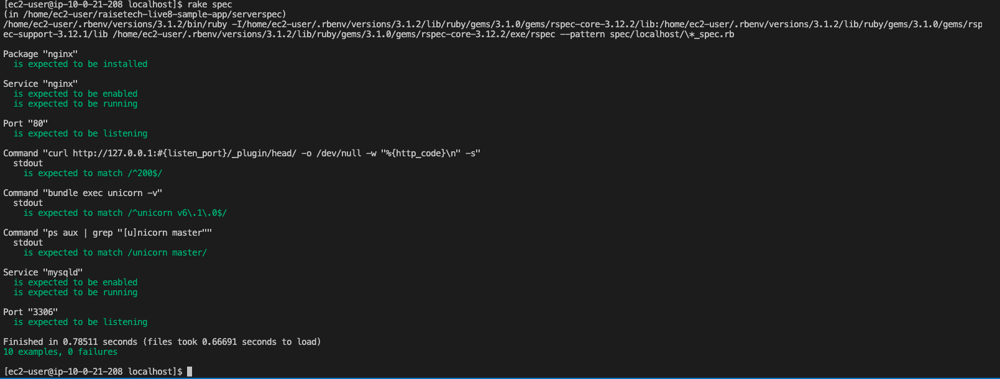

# 第11回課題

## 課題内容
* ServerSpec のテストを成功させる。 
* [サンプルコード](https://github.com/MasatoshiMizumoto/raisetech_documents/tree/main/aws/samples/serverspec)を使用し、授業を参考に自由な発想で内容をカスタマイズしてみる。

## 自前準備
* 第5回で作成したEC2にServerSpecをインストールし設定する。  

### Serverspec初期設定  
* Server specテスト環境を初期化するコマンドを入力。
```
$ serverspec-init
```
	
* このコマンドを実行すると、テスト環境の設定を行うための一連の質問に答えるよう求められる。
	
```
Select OS type:　　                # OSタイプの選択
	
1) UN*X                     　　   # UNIX系のOS（Linux, macOSなど）
2) Windows                      # Windows OS
Select number: 1                # UN*Xなので 1 を入力
	
Select a backend type:          # テストの実行方法を選択
	
1) SSH                          # リモートサーバーにSSH経由で接続
2) Exec (local)                 # ローカル上でテストを実行
Select number: 2                # ローカル上なので２を選択
```  
	
* 以下のディレクトリとファイルが生成される。
```
+ spec/                             # テストスクリプトを格納するディレクトリ
+ spec/localhost/                   # ローカルマシンのテストスペックを格納するディレクトリ
+ spec/localhost/sample_spec.rb     # サンプルのテストスクリプト
+ spec/spec_helper.rb               # Serverspecの共通設定を記述するファイル
+ Rakefile                          # Rakeタスクを定義するファイル（Serverspecのテストを実行するためのタスクが設定されている）
```
	

## テストコードの編集
* 提供されたサンプルテストコードを元に、`spec/localhost/sample_spec.rb`の内容を変更。
* サンプルテストコードに以下を追加
    1. Nginxが有効かつ稼働中であること
    2. Unicorn関連のテスト
    3. MySQL関連のテスト  
   

```
require 'spec_helper'

listen_port = 80

# Nginx関連のテスト
# Nginxパッケージがインストールされていることを確認
describe package('nginx') do
  it { should be_installed }
end

# Nginxサービスが有効かつ稼働中であることを確認
describe service('nginx') do
  it { should be_enabled }
  it { should be_running }
end

# ポート80がリスニング状態であることを確認
describe port(listen_port) do
  it { should be_listening }
end

# ローカルホストのポート80に対するHTTPリクエストが成功している（HTTPステータスコード200）ことを確認
describe command('curl http://127.0.0.1:#{listen_port}/_plugin/head/ -o /dev/null -w "%{http_code}\n" -s') do
  its(:stdout) { should match /^200$/ }
end

# Unicorn関連のテスト
# Unicornのバージョンが6.1.0であることを確認(インストールの確認)
describe command('bundle exec unicorn -v') do
  its(:stdout) { should match(/^unicorn v6\.1\.0$/) }
end

# Unicorn master プロセスが実行中であることを確認
describe command('ps aux | grep "[u]nicorn master"') do
  its(:stdout) { should match /unicorn master/ }
end

# MySQL関連のテスト
# MySQL（mysqld）が有効かつ稼働中であることを確認
describe service('mysqld') do
  it { should be_enabled }
  it { should be_running }
end

# MySQLがポート3306でリスニングしていることを確認
describe port(3306) do
  it { should be_listening }
end
```  

### テストコードのメモ
* リソースタイプはテストの対象を、マッチャーはその対象に対する期待を表現している。
```
describe リソースタイプ(**) do
  it { マッチャー }
end
```  
```  
# 例
describe port(3306) do
  it { should be_listening }
end
```  

#### リソースタイプ
* テストの対象となる要素を指定。
* 例では`port(3306)` がリソースタイプで、特定のポート（この場合は`3306`）に関するテストを行うことを意味している。  
	
##### 主要なリソースタイプ
|リソースタイプ|説明|
|:--|:--|
| `package`      | 指定されたパッケージがインストールされているかをテスト |
| `port`         | 特定のポートがリスニング状態にあるかをテスト         |
| `service`      | 指定されたサービスが実行中か、有効かをテスト        |
| `file`         | ファイルの存在、内容、権限などをテスト           |
| `command`      | コマンドの実行結果をテスト                   |
| `user`         | ユーザーの存在や属性をテスト                  |
| `group`        | グループの存在や属性をテスト                  |


#### マッチャー
* マッチャーは、リソースに対して期待する状態や振る舞いを表す。
* 例では`should be_listening` はマッチャーで、`port(3306)` がリスニング状態（接続を待ち受けている状態）であることを期待するというテストの条件を定義している。  
	
#### 主要なマッチャー
| マッチャー      | 説明                                        |
|:--|:--|
| `be_installed`  | パッケージがインストールされていることを確認      |
| `be_running`    | サービスやプロセスが実行中であることを確認        |
| `be_enabled`    | サービスが有効化されていることを確認             |
| `be_listening`  | ポートがリスニング状態であることを確認            |
| `contain`       | ファイルの内容が指定した文字列を含むことを確認      |
| `be_owned_by`   | ファイルが特定のユーザーに所有されていることを確認  |
| `have_uid`      | ユーザーが特定のUIDを持つことを確認              |
| `have_gid`      | ユーザーまたはグループが特定のGIDを持つことを確認   |

	


## テスト実行
```
$ rake spec
``` 
## テスト結果
* テスト成功を確認

