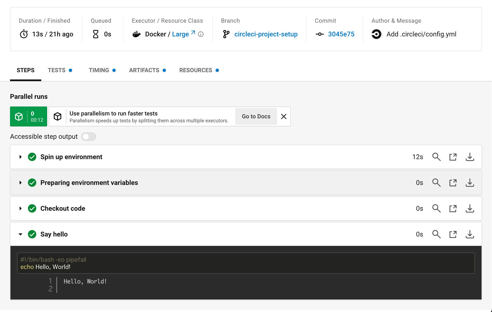
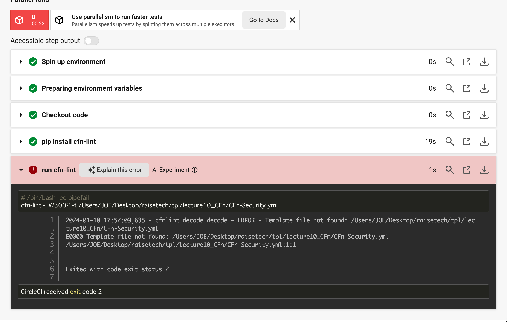
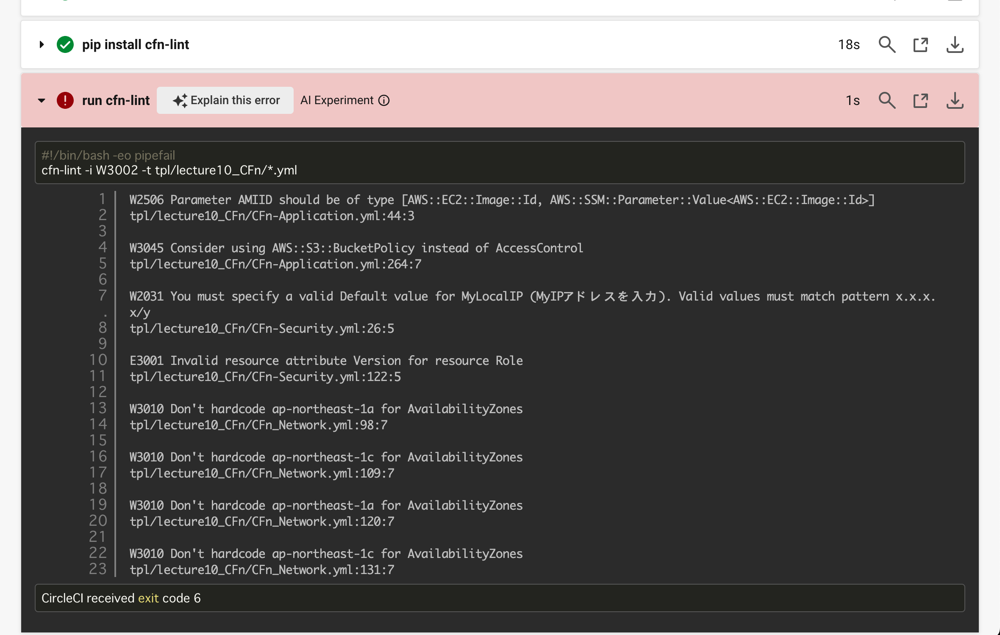
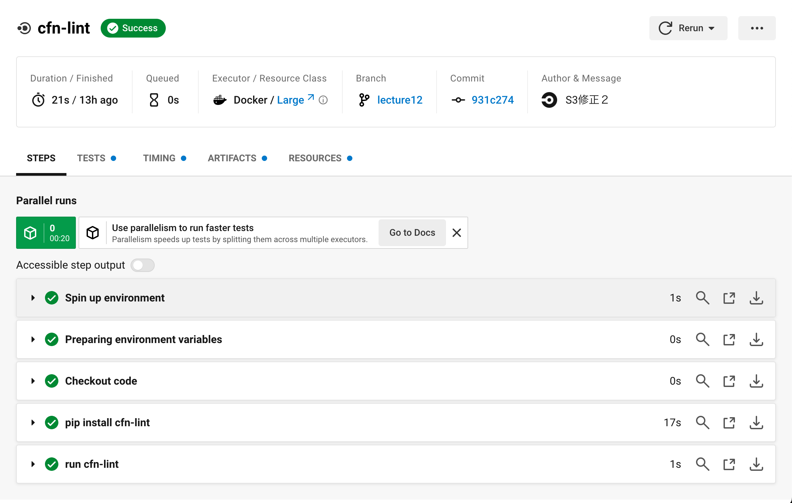

# 第12回課題

## 課題内容
* 提供された[CircleCI のサンプルコンフィグ](https://github.com/MasatoshiMizumoto/raisetech_documents/tree/main/aws/samples/circleci)を使用し、正しく動作するようにリポジトリに組み込む。


## 自前準備
* CircleCIユーザー登録
* githubと連携させる
* CLIインストール  
<br>


## デプロイキーを設定  

 * 以下のコマンドを使用して、端末にSSH Key pair を生成する。
```  
$ ssh-keygen -t ed25519 -f ~/.ssh/project_key -C email@example.com
# パスフレーズは空欄にしたままEnter×2
```  

 * `pbcopy`コマンドを使用し、public SSH keyをクリップボードにコピー。
```
$ pbcopy < ~/.ssh/project_key.pub
```  
<br>
 * コピーしたpublic SSH keyを[GitHub のデプロイキーとしてリポジトリに追加。](https://docs.github.com/en/authentication/connecting-to-github-with-ssh/managing-deploy-keys#set-up-deploy-keys)  

<br>

 * `pbcopy` コマンドでprivate SSH keyをコピーし、Create New Projectのprivate SSH keyフィールドにペースト。
```
$ pbcopy < ~/.ssh/project_key
```  
 * リポジトリを選択し、プロジェクト名を記入。
 * プロジェクト作成を実行。
<br>
	
## 公式ドキュメント通りに操作して動作を確認。
 * [circleCIのスタートガイド](https://circleci.com/docs/ja/getting-started/)の手順通りに進め、`Hello, World`を確認。

  

## ローカルCLIのインストール  
[CLIインストール公式doc](https://circleci.com/docs/ja/local-cli/)
* ターミナルで以下を実行
```
# Mac と Linux の場合
$ curl-fLSshttps://raw.githubusercontent.com/CircleCI-Public/circleci-cli/master/install.sh |bash
```
 *  CircleCI の CLI ツールは、デフォルトで /usr/local/bin ディレクトリにインストールされる。
 *  /usr/local/bin への書き込みアクセス権を持っていない場合は、上記コマンドのパイプと bash の間に sudo を挿入して実行。  
<br>

## CLI の設定
 * CLIを使用する前に[Personal API Tokensを生成。](https://app.circleci.com/settings/user/tokens)
 * 生成したAPIトークンをコピーし保管。

 * トークンを取得したら、以下を実行して CLI を設定。
```
$ circleci setup
```
* `CircleCI API Token`でPersonal API Tokensをペースト。
* `/Users/user_name/.circleci/cli.yml.`に設定が保存される。  
<br>

## コンフィグファイルを作成
 * `/.circleci`に`config.yml`を作成し、CircleCI のサンプルコンフィグをペースト
```
version: 2.1
orbs:
  python: circleci/python@2.0.3
jobs:
  cfn-lint:
    executor: python/default
    steps:
      - checkout
      - run: pip install cfn-lint
      - run:
          name: run cfn-lint
          command: |
            cfn-lint -i W3002 -t cloudformation/*.yml      # 自分のリポジトリのパスに変更

workflows:
  raisetech:
    jobs:
      - cfn-lint

```
※  `.circleci`ディレクトリがリポジトリ外にあったらリポジトリ内に移動させる。  
<br>  

 * `.circleci`ディレクトリの一つ上の階層に移動し、以下を実行。
```
# CircleCIの設定ファイルが正しい構文と設定を持っているかどうかを検証。
$ circleci config validate
```

 * 以下が表示され検証が成功
```
Config file at .circleci/config.yml is valid.
```  
<br>

## 動作の確認
### lecture12ブランチを作成し、.circleci/config.ymlをpushする。
 * 最初は サンプルコンフィグのディレクトリパスを `/Users/JOE/Desktop/raisetech/tpl/lecture10_CFn/CFn_Network.yml`にしていた為、以下のエラーが出た。
   
このエラーからわかることは、指定されたファイルパスに存在しないテンプレートファイルをCFnLintが読み込もうとして失敗したということ。  
<br>

 * パスをリポジトリのディレクトリ１つ下階層からにし、ファイル名を`*.yml`変更し実行。
   
画像のようなエラーが出てくる。
<br>

### エラーの内容
* AZがハードコードされている為、テンプレートの柔軟性が低下している。
* Roleリソースで不正な属性Versionが使用されている。 
* MyLocalIPパラメータのデフォルト値が正しい形式でない。 
* S3バケットのアクセスコントロールを直接指定する代わりに、`AWS::S3::BucketPolicy`を使用することを推奨している。    

## 修正の結果
 * [CFn_Network.yml](./tpl/lecture10_CFn/CFn_Network.yml)、[CFn-Security.yml](./tpl/lecture10_CFn/CFn-Security.yml)、[CFn-Application.yml](./tpl/lecture10_CFn/CFn-Application.yml)をそれぞれエラーの要望通りに修正し再度push。
### Successを確認
   
